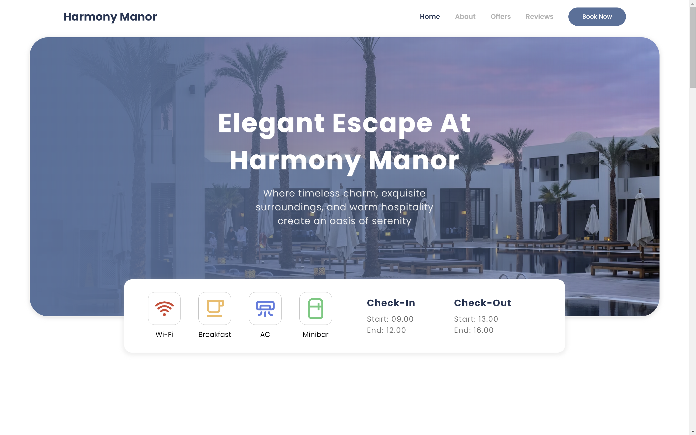

# Harmony Manor 🌿

Welcome to **Harmony Manor**, a beautifully designed landing page for a villa or hotel, offering a serene escape in a luxurious setting. Explore the features of our exquisite property, discover our amenities, and find the perfect retreat to relax and unwind. This application is built using [React.js](https://reactjs.org/) with the create-react-app boilerplate and is hosted on [Vercel](https://vercel.com/).

<br>

## 🚀 Live Demo

Experience the live version of the landing page:  
[https://harmony-manor.vercel.app](https://harmony-manor.vercel.app).

## 🛠️ Features

- **Stunning Visuals**: Captivating images and videos showcasing the beauty of Harmony Manor.
- **Responsive Design**: A seamless browsing experience on all devices, including desktops, tablets, and smartphones.
- **Amenities Overview**: Detailed descriptions of the villa's luxurious amenities and services.
- **Contact Form**: Easy-to-use contact form for inquiries and bookings.
- **Location Information**: Integrated map and directions to help guests find us easily.
- **Social Media Links**: Stay connected through our social media channels.

## 💻 Technologies Used

- **Frontend**: React.js, JavaScript, CSS
- **Tooling**: Create React App
- **Hosting**: Vercel

## 📸 Screenshots



## 🔧 Installation

If you want to run this project locally, follow these steps:

1. Clone the repository:
   ```bash
   git clone https://github.com/Kezota/guess-my-number.git
   ```
2. Navigate to the project directory:
   ```bash
   cd guess-my-number
   ```
3. Install the dependencies:
   ```bash
   npm install
   ```
4. Start the development server:
   ```bash
   npm start
   ```
5. Open `http://localhost:3000` in your browser to view the game.

## 🤝 Contributing

If you'd like to contribute to the development of this project, feel free to fork the repository and submit a pull request. Contributions are always welcome!
